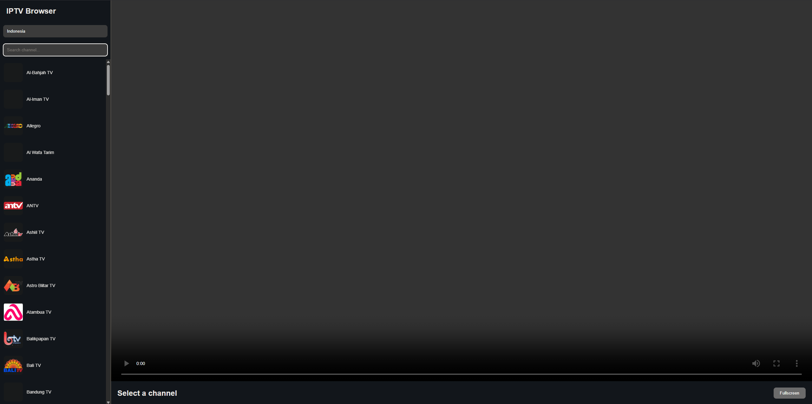

# 📺 IPTV Browser

A simple fullstack web application for browsing IPTV channels using M3U playlist or Xtream Codes API.

> ⚠️ DISCLAIMER  
> This project is built strictly for **learning and educational purposes only**.  
> It does not host, store, or distribute any IPTV content or streams.  
> All data sources are external and users are fully responsible for how they use this application.

---

## Preview

---

## Why This Project Exists

IPTV sources are often fragmented, inconsistent, and hard to consume directly.
This service acts as a unified aggregation layer that normalizes IPTV data into a structured format, making it easier to integrate into applications or downstream services.

---

## Features

* Aggregates IPTV metadata (countries, channels, streams, logos)
* Concurrent data fetching using Go routines
* Clean layered architecture (handler, service, repository)
* Lightweight and fast execution
* Easy to extend for caching, filtering, or additional sources

---

## Tech Stack

* Go (Golang)
* JSON processing
* REST architecture
* Goroutines & concurrency primitives

---

## Architecture

The project follows a simple layered architecture:

* **Handler Layer** → Handles HTTP requests and responses
* **Service Layer** → Contains business logic and data processing
* **Repository Layer** → Responsible for data fetching and external sources

This structure keeps the system modular, testable, and easy to scale.

## Concurrency Design

The system uses Go goroutines to fetch IPTV resources in parallel.
This reduces latency when aggregating data from multiple sources.
Synchronization is handled using wait groups to ensure safe completion of all concurrent tasks before returning results.

---

## Disclaimer

This project only aggregates publicly available IPTV metadata and does not host or distribute any media content.

---
